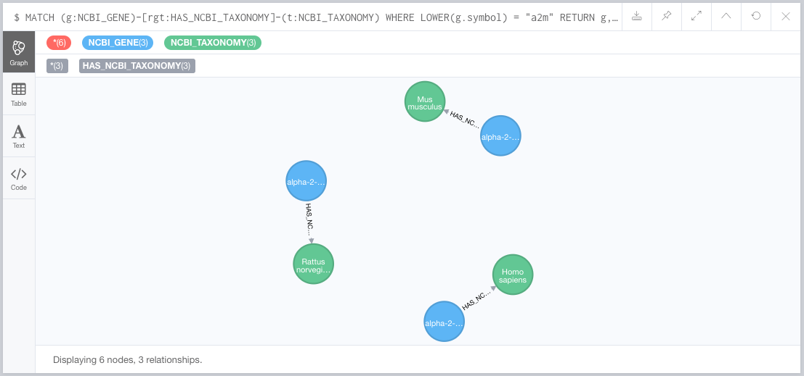

# Tutorial

Please be advised that most of these queries apply the "LIMIT" command to control the amount of data returned, for the purpose of demonstrating the results of each query effectively. In a programmatic database search, one wouldn't want to do this.

Also, your visual results may differ from those shown here.

## Basic stuff

Find all the taxonomies listed in the database:
```sql
MATCH (t:NCBI_TAXONOMY) RETURN t LIMIT 25;
```


Repeat this procedure in tabular form, showing details:
```sql
MATCH (t:NCBI_TAXONOMY) RETURN t.id as taxonomy_id, t.name AS species_name LIMIT 25;
```


Find "orthologs" of A2M--in this case genes with the same symbol but different capitalization--in the database, showing their respective species as well:
```sql
MATCH (g:NCBI_GENE)-[rgt:HAS_NCBI_TAXONOMY]-(t:NCBI_TAXONOMY) WHERE LOWER(g.symbol) = "a2m" RETURN g, rgt, t LIMIT 25;
```



Add Gene Ontology information to the previous query:
```sql
MATCH (go:GENE_ONTOLOGY)<-[rgog:HAS_GENE_ONTOLOGY]-(g:NCBI_GENE)-[rgt:HAS_NCBI_TAXONOMY]-(t:NCBI_TAXONOMY) WHERE LOWER(g.symbol) = "a2m" RETURN go, rgog, g, rgt, t LIMIT 50;
```


Find the PubMed IDs that simultaniously involve genes A2M and BRCA1:
```
MATCH (g1:NCBI_GENE)<-[rg1p:INVOLVES_NCBI_GENE]-(p:NCBI_PUBMED)-[rg2p:INVOLVES_NCBI_GENE]->(g2:NCBI_GENE) WHERE g1.symbol = "BRCA1" AND g2.symbol = "A2M" RETURN g1, rg1p, p, rg2p, g2 LIMIT 25;
```


Here is the full tabular view of the previous query:


But we might, for the sake of an automated query for example, want to explicitly specify what we want to see in content returned, e.g.:
```sql
MATCH (g1:NCBI_GENE)<-[rg1p:INVOLVES_NCBI_GENE]-(p:NCBI_PUBMED)-[rg2p:INVOLVES_NCBI_GENE]->(g2:NCBI_GENE) WHERE g1.symbol = "BRCA1" AND g2.symbol = "A2M" RETURN g1.id AS gene_1_NCBI_ID, g1.symbol AS gene_1_symbol, g2.id AS gene_2_NCBI_ID, g2.symbol AS gene_2_symbol, p.id AS pubmed_ID;
```


Find the synonyms for "A2M":
```sql
MATCH (g:NCBI_GENE)-[r:HAS_NCBI_GENE_SYNONYM]->(gs:NCBI_GENE_SYNONYM) WHERE g.symbol = "A2M" RETURN g, r, gs;
```


Find gene synonyms where the synonym is associated with more than one human gene:
```sql
MATCH (t:NCBI_TAXONOMY), (t)<-[rtg1:HAS_NCBI_TAXONOMY]-(g1:NCBI_GENE)-[rg1gs:HAS_NCBI_GENE_SYNONYM]->(gs:NCBI_GENE_SYNONYM)<-[rg2gs:HAS_NCBI_GENE_SYNONYM]-(g2:NCBI_GENE)-[rtg2:HAS_NCBI_TAXONOMY]->(t) WHERE t.id = 9606 AND g1.id <> g2.id RETURN g1, rg1gs, gs, rg2gs, g2 LIMIT 25;
```


Same query, but extracting only the symbols:
```sql
MATCH (t:NCBI_TAXONOMY), (t)<-[rtg1:HAS_NCBI_TAXONOMY]-(g1:NCBI_GENE)-[rg1gs:HAS_NCBI_GENE_SYNONYM]->(gs:NCBI_GENE_SYNONYM)<-[rg2gs:HAS_NCBI_GENE_SYNONYM]-(g2:NCBI_GENE)-[rtg2:HAS_NCBI_TAXONOMY]->(t) WHERE t.id = 9606 AND g1.id <> g2.id RETURN gs.symbol AS SYNONYM, g1.symbol AS gene_1_symbol, g2.symbol AS gene_2_symbol LIMIT 25;
```


### Aggregations

Count how many distinct PubMed articles are associated with each human gene:
```sql
MATCH (t:NCBI_TAXONOMY)<-[rtg:HAS_NCBI_TAXONOMY]-(g:NCBI_GENE)<-[rp:INVOLVES_NCBI_GENE]-(p:NCBI_PUBMED) WHERE t.id = 9606 RETURN g.symbol AS gene, COUNT(p) AS pubmed_count;
```


## Focusing on the data provided by Harvard Medical School

Retrieve all the diseases:
```sql
MATCH (d:HMS_DISEASE) RETURN d;
```


Connect genes assocated with the diseases:
```sql
MATCH (d:HMS_DISEASE)-[rdg:INVOLVES_NCBI_GENE]->(g:NCBI_GENE) RETURN d, rdg, g LIMIT 25;
```


### Aggregations

Count how many distinct genes are associated with each disease:
```sql
MATCH (d:HMS_DISEASE)-[rdg:INVOLVES_NCBI_GENE]->(g:NCBI_GENE) RETURN d.name AS disease, COUNT(g) AS genes_per_disease;
```


Count how many distinct Gene Ontology terms are associated with the genes involved in each disease (and sort them):
```sql
MATCH (d:HMS_DISEASE)-[rdg:INVOLVES_NCBI_GENE]->(g:NCBI_GENE)-[rggo:HAS_GENE_ONTOLOGY]->(go:GENE_ONTOLOGY) RETURN d.name AS disease, COUNT(go) AS number_of_gene_ontology_terms ORDER BY number_of_gene_ontology_terms DESC;
```


### Advanced mathematical graph analysis

This material requires that you have the algorithms package installed in your Neo4j instance.

Measure the similarity between each pair of diseases with respect to genes in common using the Jaccard similarity metric:
```sql
MATCH (d:HMS_DISEASE)-[rdg:INVOLVES_NCBI_GENE]->(g:NCBI_GENE)
WITH {item:id(d), categories: collect(id(g))} as disease_data
WITH collect(disease_data) as data
CALL algo.similarity.jaccard.stream(data)
YIELD item1, item2, count1, count2, intersection, similarity
RETURN algo.getNodeById(item1).name AS disease_from, algo.getNodeById(item2).name AS disease_to, intersection, similarity AS disease_Jaccard_similarity
ORDER BY disease_Jaccard_similarity DESC
```


Apply a weighted PageRank algorithm to determine the most important genes with respect to the diseases:
```sql
CALL algo.pageRank.stream('NCBI_GENE', 'SHARE_ONE_OR_MORE_HMS_DISEASES', {iterations:20, dampingFactor:0.85, weightProperty: "disease_count"})
YIELD nodeId, score
RETURN algo.getNodeById(nodeId).name AS gene, score
ORDER BY score DESC
```


